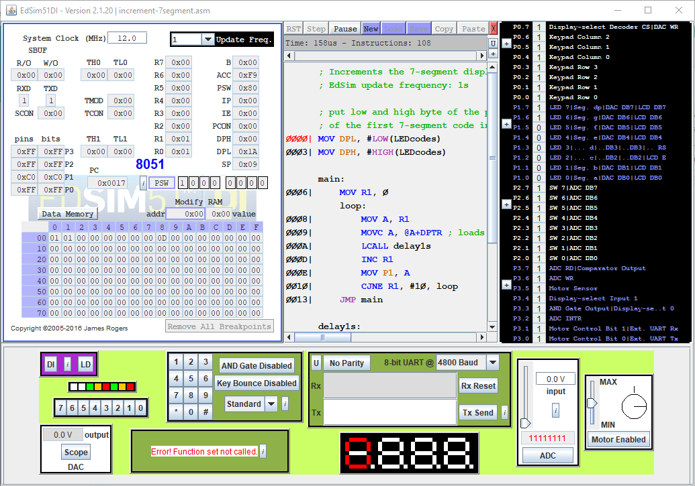

# Learn 8051

A collection of 8051 EdSim51 programs used to understand the 8051 architecture.



## Understanding Stack Pointers

[understanding-stack.asm](understanding-stack.asm) shows the behaviour of 8051 stack pointer.

## Path from C file to 8051 byte code

First install `sdcc` (a small cross compiler for various microcontrollers, [http://sdcc.sourceforge.net/](http://sdcc.sourceforge.net/)) on your machine. For Windows 10, pre compiled binaries were used. Optionally, add SDCC to `PATH` in order to run `sdcc` from any arbitrary path on your machine.

Take a look of the [example](from-c-to-opcode\addition.c) `.c` file  - we will use its logic to examine the assembly and byte code on the 8051.

Let's compile it:

```cmd
sdcc .\from-c-to-opcode\addition.c -o .\from-c-to-opcode\
```

After this command a lot of files are generated in the output folder.

Let's examine the [`addition.asm`](from-c-to-opcode\addition.asm) file. We ignore the various assembly meta data.

Destilled core of this file:

```assembly
.org 0x0000

__interrupt_vect:
	ljmp	__sdcc_gsinit_startup

__sdcc_program_startup:
	ljmp	_main

;	.\from-c-to-opcode\addition.c:5: void main(void)
;	-----------------------------------------
;	 function main
;	-----------------------------------------
_main:
;	.\from-c-to-opcode\addition.c:7: for (int i=0; i<3; i++){
	mov	r6,#0x00
	mov	r7,#0x00
00103$:
	clr	c
	mov	a,r6
	subb	a,#0x03
	mov	a,r7
	xrl	a,#0x80
	subb	a,#0x80
	jnc	00105$
;	.\from-c-to-opcode\addition.c:8: char x = P1;
;	.\from-c-to-opcode\addition.c:9: x = x - 0x34;
	mov	a,_P1
	add	a,#0xcc
	mov	_P1,a
;	.\from-c-to-opcode\addition.c:7: for (int i=0; i<3; i++){
	inc	r6
	cjne	r6,#0x00,00103$
	inc	r7
	sjmp	00103$
00105$:
;	.\from-c-to-opcode\addition.c:12: }
	ret
```
